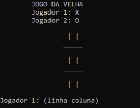
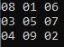
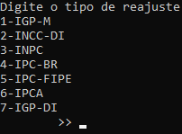

# Desafios-C
> Esses exercícios e desafios foram propostos em sala durante todo o final do primeiro sementre do curso de ADS.

## Desafios
1. [Jogo da velha](#jogo-da-velha)
2. [Quadrado perfeito](#quadrado-perfeito)
3. [Reajuste de aluguel](#reajuste-de-aluguel)

#### Jogo da velha
Esse desafio por si só já é autoexplicativo, desenvolva o jogo da velha.

**Uma única mudança que deve ser feita para o funcionamento do mesmo é a mudança da [linha 96](Desafios/jogodavelha.c#L96) do código caso esteja sendo executado no sistema operacional windows.**

#### Quadrado perfeito
O desafio trata-se de criar uma matriz ímpar e deve ser preenchida todos as posições do vetor com números, mas nenhum número pode se repetir, e para se tornar um quadrado perfeito, a soma de qualquer linha, coluna ou diagonal devem dar o mesmo valor.

#### Reajuste de aluguel
Esse foi um grande desafio, criar um programa reajuste um aluguel informado utilizando os indices de reajuste de aluguel *IGP-M*, *INCC-DI*, *INPC*, *IPC-Br*, *IPC-Fipe*, *IPCA* e *IPC-DI*. Para realizar esse desafio foi utilizado como modelo o site do [Cálculo Exato](https://calculoexato.com.br/parprima.aspx?codMenu=AlugReajuste)

## Instalação
> Para o funcionamento de qualquer um dos desafios pode ser utilizado qualquer compilador C ou IDE. Não há a necessidade de instalação de qualquer outro pacote externo.
